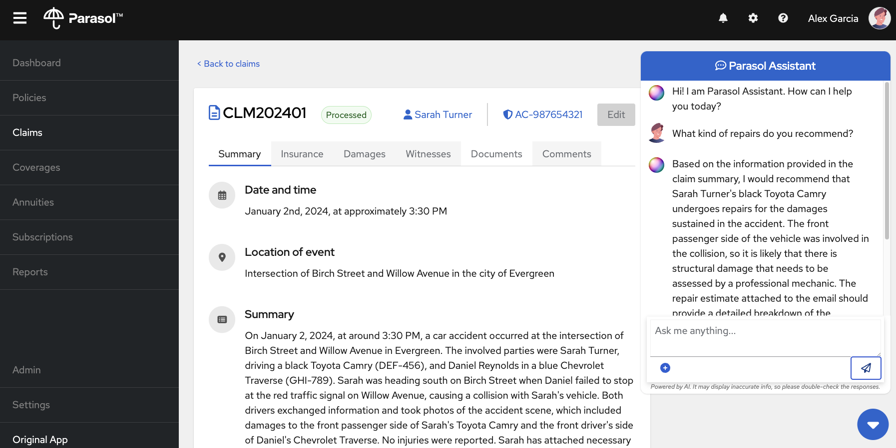

# Parasol Insurance - Node.js App

A [Node.js](https://nodejs.org/) + [React](https://react.dev/) AI app for managing fictitious insurance claims. 



## Pre-requisites

- Node.js 18 or later -- Get it https://nodejs.org/en/download .
- npm 10+ -- Node.js includes npm
- An OpenAI-capable LLM inference server. Get one here with [InstructLab](https://github.com/instructlab/instructlab)!

## Configuration

You can change the coordinates (host/port and other stuff) for the LLM and backend in [`.env`](.env).

## Running

First, get your inference server up and running. For example, with [InstructLab](https://github.com/instructlab/instructlab), the default after running `ilab serve` is that the server is listening on `localhost:8000`. This is the default for this app as well.

First Build the webui:

```
cd node-app
npm run buildui
```

Then run the node.js app:

```
npm install
node server.mjs
```
App will open on `http://0.0.0.0:8005`.

Open the app, click on a claim, click on the chat app, and start asking questions. The context of the claim is sent to the LLM along with your Query, and the response is shown in the chat (it may take time depending on your machine's performance).
